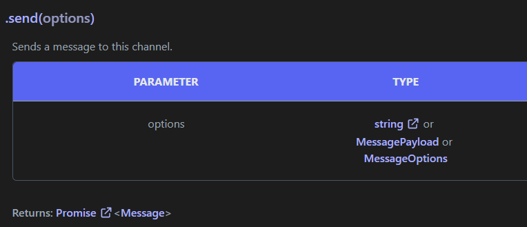

# Entendiendo la notación

A lo largo de la documentación de discord.js y cuando pida ayuda, se encontrará con muchos tipos diferentes de notaciones. Para ayudarlo a comprender los textos que lee, repasaremos algunas notaciones estándares.

::: tip
Tenga siempre en cuenta que la notación no siempre es rigurosa. Habrá errores tipográficos, malentendidos o contextos que harán que la notación difiera de los significados habituales.
:::

## Clases

Algunas notaciones comunes se refieren a una clase o a las propiedades, métodos o eventos de una clase. Hay muchas variaciones en estas notaciones, y son muy flexibles según la persona, así que use su mejor juicio al leerlas.

La notación `<Clase>` significa una instancia de la clase `Clase`. Por ejemplo, un fragmento como `<Message>.reply('Hola')` le pide que reemplace `<Message>` con algún valor que sea una instancia de `Message`, ej. `msg.reply('Hola')`. También podría ser un marcador de posición, ej., `<id>` significaría un marcador de posición para alguna Id.

La notación `Clase#foo` puede referirse a la propiedad, método o evento `foo` de la clase `Clase`. A lo que se refiera el escritor debe determinarse a partir del contexto. Por ejemplo:

- `Message#author` significa que debe hacer referencia a la propiedad `author` en un `Message`.
- `TextChannel#send()` significa que debe consultar el método `send()` en un `TextChannel`.
- `Client#message` significa que debe hacer referencia al evento `message` en un `Client`.

::: tip
Recuerde que esta notación no es válido en JavaScript; es una forma abreviada de referirse a un fragmento de código específico.
:::

A veces, la notación se extiende, lo que puede ayudarlo a determinar a cuál se refería el escritor. Por ejemplo, `TextChannel#send(content, options)` es definitivamente un método de `TextChannel`, ya que usa la notación de funciones. `Client#event:message` es un evento ya que dice que es un evento.

Lo fundamental que hay que extraer de esta notación es que el símbolo "#" significa que solo se puede acceder a la propiedad, método o evento a través de una instancia de la clase. Desafortunadamente, muchos abusan de esta notación, por ejemplo, `<Message>#send` o` Util#resolveColor`. `<Message>` ya es una instancia, por lo que esto no tiene sentido, y `resolveColor` es un método estático; debes escribirlo como` Util.resolveColor`. Siempre consulte la documentación si está confundido.

## Tipos

En la documentación de discord.js, hay firmas de tipo en todas partes. En las propiedades, los parámetros o los valores de retorno. Si no proviene de un idioma escrito estáticamente, es posible que no sepa qué significan las notaciones específicas.

El símbolo `*` significa cualquier tipo. Por ejemplo, los métodos que devuelven `*` significan que pueden devolver cualquier cosa, y un parámetro de tipo `*` puede ser cualquier cosa.

El símbolo `?` Significa que el tipo es anulable. Puede verlo antes o después del tipo (ej., `?T` o `T?`). Este símbolo significa que el valor puede ser del tipo "T" o "nulo". Un ejemplo es `GuildMember#nickname`; su tipo es `?string` ya que un miembro puede tener o no un apodo.

La expresión `T[]` significa una matriz (array) de `T`. A veces puede ver varios corchetes `[]`, lo que indica que la matriz es multidimensional, por ejemplo, `string[][]`.

La expresión `...T` significa un parámetro rest de tipo `T`. Esto significa que la función puede aceptar cualquier cantidad de argumentos, y todos esos argumentos deben ser del tipo `T`.

El operador `|`, que puede leerse como `or`, crea un tipo de unión, ej. `A | B | C`. Simplemente, significa que el valor puede ser de cualquiera de los tipos dados.

Los corchetes angulares `<>` se utilizan para tipos genéricos o tipos parametrizados, lo que significa un tipo que utiliza otro(s) tipo(s). La notación se parece a `A<B>` donde `A` es el tipo y `B` es un parámetro de tipo. Si esto es difícil de seguir, es suficiente tener en cuenta que siempre que vea `A<B>`, puede pensar en una `A` que contenga `B`. Ejemplos:

- `Array<String>` significa una matriz (array) de cadenas de texto (string).
- `Promise<User>` Significa una `Promesa` que contiene un `Usuario`.
- `Array<Promise<User|GuildMember>>` sería una matriz (array) de `Promesas`, cada una con un `User` o un `GuildMember`.
- `Collection<Snowflake, User>` sería una `Colección`, que contiene pares clave-valor donde las claves son `Snowflake`s y los valores son `User`s.

En esta parte de la documentación, puede ver dos firmas de tipo. `string, MessagePayload o MessageOptions` y `Promise<Message>`. El significado de la palabra `or` aquí, es el mismo que el de `|`.