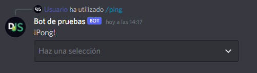
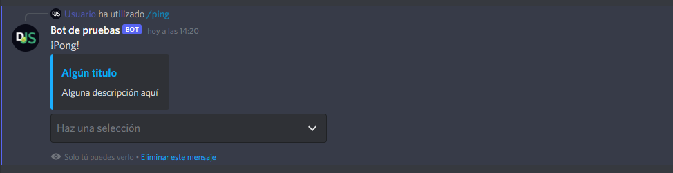

# Select menus

Con la API de `Componentes`, puede crear componentes de mensajes interactivos. En esta página, cubriremos cómo enviar, recibir y responder a `select menus` usando discord.js.

::: tip
Esta página es un seguimiento de la [página de interacciones (comandos de barra)](/interactions/registering-slash-commands.md). Por favor, léalos primero con atención para que pueda comprender los métodos utilizados en esta sección.
:::

## Construyendo y enviando select menus

Los menús seleccionados son parte de la clase `MessageComponent`, que se pueden enviar a través de mensajes o respuestas de interacción. Un `select menu`, como cualquier otro componente de mensaje, debe estar en una `ActionRow`.

::: warning
Puede tener un máximo de cinco `ActionRow` por mensaje y un `select menu` dentro de una `ActionRow`.
:::

Para crear un `select menu`, use las funciones de construcción `MessageActionRow()` y `MessageSelectMenu()` y luego pase el objeto resultante a `CommandInteraction#reply()` como `InteractionReplyOptions`:

```js {1,7-24,26}
const { MessageActionRow, MessageSelectMenu } = require('discord.js');

client.on('interactionCreate', async interaction => {
	if (!interaction.isCommand()) return;

	if (interaction.commandName === 'ping') {
		const row = new MessageActionRow()
			.addComponents(
				new MessageSelectMenu()
					.setCustomId('select')
					.setPlaceholder('Ninguna selección')
					.addOptions([
						{
							label: 'Select me',
							description: 'Esta es una descripción',
							value: 'first_option',
						},
						{
							label: 'Tu, también puedes seleccionarme',
							description: 'Esta es también una descripción,
							value: 'second_option',
						},
					]),
			);

		await interaction.reply({ content: 'Pong!', components: [row] });
	}
});
```

::: tip
El ID personalizado es una cadena de texto definida por el desarrollador de hasta 100 caracteres.
:::

Reinicie su `bot` y luego envíe el comando a un canal al que su `bot` tenga acceso. Si todo va bien, debería ver algo como esto:

<!--- vue-discord-message doesn't yet have support for select menus
<DiscordMessages>
	<DiscordMessage profile="bot">
		<template #interactions>
			<DiscordInteraction profile="user" :command="true">ping</DiscordInteraction>
		</template>
		Pong!
	</DiscordMessage>
</DiscordMessages>
-->


También puede enviar componentes de mensaje dentro de una respuesta `efímera` o junto con incrustaciones de mensajes (embeds).

```js {1,12-16,18}
const { MessageActionRow, MessageEmbed, MessageSelectMenu } = require('discord.js');

client.on('interactionCreate', async interaction => {
	if (!interaction.isCommand()) return;

	if (interaction.commandName === 'ping') {
		const row = new MessageActionRow()
			.addComponents(
				// ...
			);

		const embed = new MessageEmbed()
			.setColor('#0099ff')
			.setTitle('Some title')
			.setURL('https://discord.js.org/')
			.setDescription('Some description here');

		await interaction.reply({ content: 'Pong!', ephemeral: true, embeds: [embed], components: [row] });
	}
});
```

Reinicie su `bot` y luego envíe el comando a un canal al que su `bot` tenga acceso. Si todo va bien, debería ver algo como esto:

<!--- vue-discord-message doesn't yet have support for select menus
<DiscordMessages>
	<DiscordMessage profile="bot">
		<template #interactions>
			<DiscordInteraction
				profile="user"
				:command="true"
				:ephemeral="true"
			>ping</DiscordInteraction>
		</template>
		Pong! (+ components)
		<template #embeds>
			<DiscordEmbed
				border-color="#0099ff"
				embed-title="Some title"
				url="https://discord.js.org"
			>
				Some description here
			</DiscordEmbed>
		</template>
	</DiscordMessage>
</DiscordMessages>
-->


¡Ahora ya sabe todo lo que hay que hacer para crear y enviar un `SelectMenu`! ¡Pasemos a cómo recibir menús!

## Recibiendo Select menus

Para recibir una `SelectMenuInteraction`, adjunte un detector de eventos a su cliente y use el protector de tipo` Interaction#isSelectMenu() `para asegurarse de que solo reciba menús selectos:

```js {2}
client.on('interactionCreate', interaction => {
	if (!interaction.isSelectMenu()) return;
	console.log(interaction);
});
```

## Colección de componentes

Estos funcionan de manera bastante similar a los `collectors` de mensajes y reacciones, excepto que recibirá instancias de la clase `MessageComponentInteraction` como elementos coleccionados.

::: tip
Puede crear los `collectors` en un `mensaje` o en un `canal`.
:::

Para obtener una guía detallada sobre la recepción de componentes de mensajes a través de `collectors`, consulte la [guía de colleciones](/popular-topics/collectors.md#interaction-collectors).

## Respondiendo a select menus

La clase `MessageComponentInteraction` proporciona los mismos métodos que la clase` CommandInteraction`. Estos métodos se comportan igualmente:
- `reply()`
- `editReply()`
- `deferReply()`
- `fetchReply()`
- `deleteReply()`
- `followUp()`

### Actualización del mensaje de un select menu

La clase `MessageComponentInteraction` proporciona un método` update() `para actualizar el mensaje al que está adjunto el menú de selección. Pasar una matriz (array) vacía a la opción `componentes` eliminará cualquier menú después de que se haya seleccionado una opción.

```js {1,4-6}
client.on('interactionCreate', async interaction => {
	if (!interaction.isSelectMenu()) return;

	if (interaction.customId === 'select') {
		await interaction.update({ content: '¡Se seleccionó algo!', components: [] });
	}
});
```

### Aplazamiento y actualización del mensaje de un select menu

Además de aplazar la respuesta de la interacción, puede aplazar el menú, que activará un estado de carga y luego volverá a su estado original:

```js {1,6-10}
const wait = require('util').promisify(setTimeout);

client.on('interactionCreate', async interaction => {
	if (!interaction.isSelectMenu()) return;

	if (interaction.customId === 'select') {
		await interaction.deferUpdate();
		await wait(4000);
		await interaction.editReply({ content: '¡Se seleccionó algo!', components: [] });
	}
});
```

## Multi-select menus

Un select menu  no está limitado a una sola selección; puede especificar una cantidad mínima y máxima de opciones que deben seleccionarse. Puede utilizar `MessageSelectMenu#setMinValues()` y `MessageSelectMenu#setMaxValues()` para determinar estos valores.

```js {1,7-31,33}
const { MessageActionRow, MessageSelectMenu } = require('discord.js');

client.on('interactionCreate', async interaction => {
	if (!interaction.isCommand()) return;

	if (interaction.commandName === 'ping') {
		const row = new MessageActionRow()
			.addComponents(
				new MessageSelectMenu()
					.setCustomId('select')
					.setPlaceholder('Nada seleccionado')
					.setMinValues(2)
					.setMaxValues(3)
					.addOptions([
						{
							label: 'Seleccioname',
							description: 'Esta es una descripción',
							value: 'first_option',
						},
						{
							label: 'También puedes seleccionarme',
							description: 'Esta es también una descripción',
							value: 'second_option',
						},
						{
							label: 'Yo también soy una opcion',
							description: 'Esta es otra descripción',
							value: 'third_option',
						},
					]),
			);

		await interaction.reply({ content: 'Pong!', components: [row] });
	}
});
```
