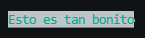

# Paquetes útiles

## Day.js

::: tip
Documentación oficial: [Aquí](https://day.js.org/en)
:::

Day.js es un paquete poderoso que analiza, valida, manipula y muestra fechas y horas en JavaScript.
Te permite formatear fechas rápida y fácilmente de la forma que desee o analizar cadenas de nuevo en objetos de fecha de JavaScript.
Hay muchos complementos que te permiten trabajar con duraciones y más.

Por ejemplo, si quieres pedirles a tus usuarios que te den una fecha,
puede usar Day.js para convertirlo en un objeto Date que puede usar en su código:

<!-- eslint-skip -->
```js
const input = await interaction.channel.awaitMessages({ 
	filter: m => m.author.id === interaction.user.id, 
	max: 1,
	time: 10e3,
	errors: ['time'],
});
const date = dayjs(input.first().content).toDate();
```

Con el [Complemento de duración](https://day.js.org/docs/en/durations/durations), puedes decirle al usuario si la fecha es en el futuro o en el pasado:

```js
if (date.isValid()) {
	const now = dayjs();
	const duration = date - now;
	const formatted = dayjs.duration(duration, 'ms').format();

	if (duration > 0) {
		interaction.reply(`La fecha que me diste es ${formatted} en el futuro.`);
	} else {
		interaction.reply(`La fecha que me diste es ${formatted} en el pasado.`);
	}
} else {
	interaction.reply('No me diste una fecha válida.');
}
```

## ms

::: tip
Documentación oficial: [Aquí](https://github.com/vercel/ms)
:::

Ms es otra herramienta para trabajar con tiempos en JavaScript. Sin embargo, ms se especializa en duraciones.
Te permite convertir tiempos en milisegundos a formatos legibles por humanos y viceversa.

Ejemplo:

<!-- eslint-skip -->
```js
await interaction.reply('Envía dos mensajes y te diré a qué distancia los enviaste.
const messages = await interaction.channel.awaitMessages({
	filter: m => m.author.id === interaction.user.id,
	max: 2,
	time: 30e3,
	errors: ['time'],
});

const difference = messages.last().createdTimestamp - messages.first().createdTimestamp;
const formatted = ms(difference);

await interaction.followUp(Enviaste los dos mensajes ${formatted} aparte.`);
```

## common-tags

::: tip
Documentación oficial: [Aquí](https://github.com/zspecza/common-tags)
:::

Common-tags es una biblioteca dedicada al trabajo con literales de plantilla.
Hasta ahora, probablemente solo la hayas usado para interpolar variables en sus cadenas, pero puedes hacer mucho más.
Si tiene tiempo, deberías consultar [La documentación de MDN sobre *literales etiquetados*](Https://developer.mozilla.org/en-US/docs/Web/JavaScript/Reference/Template_literals#Tagged_templates).

Alguna vez te molestó que sus cadenas de varias líneas tuvieran partes desagradables de sangría en ellas,
pero no quería eliminar la sangría en su código fuente?
common-tags lo tiene cubierto:

```js
const packageName = 'common-tags';

if (someCondition) {
	const poem = stripIndents`
		I like ${packageName}.
		It makes my strings so pretty,
		you should use it too.
	`;

	console.log(poem);
}
```
Esto imprimirá tu pequeño poema como se esperaba, pero no tendrá pestañas ni otros espacios en blanco a la izquierda.

¡Pero esto es sólo el comienzo! Otro conjunto de funciones útiles son las funciones relacionadas con la lista:
`inlineLists`,` commaLists`, etc.
Con ellos, puede interpolar fácilmente arreglos en sus cadenas sin que se vean feos:

```js
const options = ['add', 'delete', 'edit'];

// -> ¿Quieres que agregue, elimine o edite el canal?
interaction.reply(oneLineCommaListsOr`
	Quieres que me vaya al canal ${options}?
`);
```

Colsulta la documentación para encontrar más funciones útiles.

## chalk

::: tip
Documentación oficial: [Aquí](https://www.npmjs.com/package/chalk)
:::
Chalk no es exactamente útil para los bots de Discord, pero hará que la salida de tu terminal sea mucho más bonita y organizada.
Este paquete le permite colorear y diseñar su `console.log`s de muchas formas diferentes; No más blanco sobre negro.

Supongamos que quieres que sus mensajes de error sean fácilmente visibles; Démosles un bonito color rojo:

```js
console.error(chalk.redBright('FATAL ERROR'), '¡Algo realmente malo pasó!');
```


También puede encadenar varios multiplicadores diferentes.
Si quieres tener texto verde, un fondo gris y tenerlo todo subrayado, es posible:

```js
console.log(chalk.green.bgBrightBlack.underline('Esto es tan bonito.'));
```



## winston

::: tip
Documentación oficial: [Aquí](https://github.com/winstonjs/winston)
:::

Winston es "un registrador de casi todo".
Puede iniciar sesión en la terminal, puede iniciar sesión en un archivo, etc.
"Pero espera", te escucho gritar, "¿qué pasa con` console.log`? ".
Bueno, la respuesta es simple: `console.log` es lento y no del todo versátil.
Siempre que llames a `console.log`, su programa se detiene; no puede hacer nada hasta que termine `console.log`, lo que no suena bien.
Bueno, para eso es precisamente Winston.

Winston es rápido y altamente configurable. Tiene diferentes niveles de registro para todas sus necesidades; puede iniciar sesión en archivos, la terminal, etc.
Al igual que moment.js, también tiene paquetes de extensión. Entonces, si hay algo que siente que falta, probablemente pueda encontrar uno que se adapte a sus necesidades.

Ahora, hay *muchas* opciones, por lo que se recomienda que eche un vistazo a los documentos usted mismo.
Pero obtengamos una descripción general rápida de lo que puede hacer:

```js
const client = new Client({ intents: [Intents.FLAGS.GUILDS] });

const logger = winston.createLogger({
	transports: [
		new winston.transports.Console(),
		new winston.transports.File({ filename: 'log' }),
	],
	format: winston.format.printf(log => `[${log.level.toUpperCase()}] - ${log.message}`),
});

client.on('ready', () => logger.log('info', 'El bot esta encendido'));
client.on('debug', m => logger.log('debug', m));
client.on('warn', m => logger.log('warn', m));
client.on('error', m => logger.log('error', m));

process.on('uncaughtException', error => logger.log('error', error));

client.login('el-token');
```

El código anterior crea un registrador simple que se registrará tanto en la consola como en un archivo llamado "log" (definido por las opciones de `transportes`).
La opción `formato` le dice al registrador qué formato usar para los mensajes; de forma predeterminada, genera objetos JSON.
Si bien es útil, JSON no es muy legible, por lo que definimos un formato personalizado que muestra el nivel de registro en mayúsculas junto al mensaje.
Si quieres, también puedes usar el módulo de tiza para hacer que el formato del registrador sea un poco más bonito aplicando colores, etc.


Sin embargo, Winston no es la única biblioteca de registro que existe, por lo que si no está convencido, debería buscar en Google un poco y
deberías encontrar algo que te guste.
## i18next

::: tip
Documentación oficial: [Aquí](https://www.i18next.com)
:::

18next es un marco de internacionalización para JavaScript. Es beneficioso traducir los mensajes de usuario de su bot a varios idiomas según el servidor en el que se utiliza.

Cubrir un ejemplo de caso de uso completo para la internacionalización estaría fuera del alcance de esta guía y requiere más explicación sobre cómo funciona el sistema. Consulta la documentación oficial vinculada anteriormente para obtener una guía de uso detallada.

