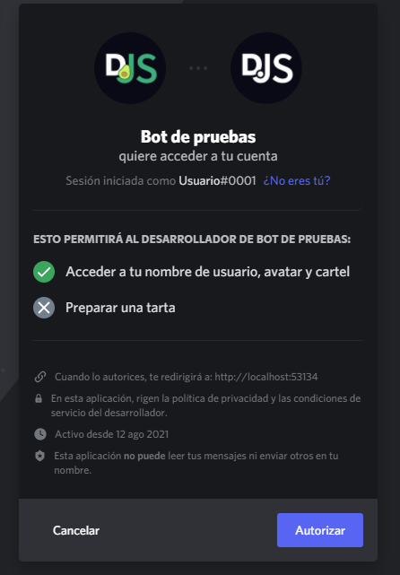

# Introducción a OAuth2

OAuth2 permite que los desarrolladores puedan crear aplicaciones que usen la autenticación y datos de la API de Discord. Los desarrolladores pueden usar esto para crear cosas como dashboards web para mostrar información del usuario, obtener cuentas de terceros vinculadas del mismo (como Twitch o Steam), acceder a la información de los servidores de los usuarios sin necesidad de estar en ellos, y mucho más. OAuth2 puede ampliar significativamente la funcionalidad de tu bot si es utilizado correctamente.

## Un ejemplo rápido

### Configurando un servidor web básico

La mayoría del tiempo, los sitios web usan OAuth2 para obtener información acerca de sus usuarios desde un servicio externo. En este ejemplo, usaremos [`express`](https://expressjs.com/) para crear un servidor web que use la información de Discord de un usuario para darle la bienvenida. Comienza creando tres archivos: `config.json`, `index.js`, y `index.html`.

`config.json` se usará para almacenar la ID de la aplicación, el token de la misma, y el puerto del servidor.

```json
{
	"clientId": "",
	"clientSecret": "",
	"port": 53134
}
```

`index.js` será usado para iniciar el servidor web y manejar las peticiones. Cuando alguien visite la página principal (`/`), se le enviará un archivo HTML como respuesta.

```js
const express = require('express');
const { port } = require('./config.json');

const app = express();

app.get('/', (request, response) => {
	return response.sendFile('index.html', { root: '.' });
});

app.listen(port, () => console.log(`Servidor escuchando a http://localhost:${port}`));
```

`index.html` será usado para mostrar la interfaz de usuario, y los datos de OAuth una vez que la sesión se inicie.

```html
<!DOCTYPE html>
<html>
<head>
	<meta charset="utf-8">
	<title>Mi aplicación OAuth2</title>
</head>
<body>
	<div id="info">
		¡Holi!
	</div>
</body>
</html>
```

Después de ejecutar `npm i express`, podrás iniciar tu servidor web con `node index.js`. Una vez se inicie, abre `http://localhost:53134` y deberías de ver un "¡Holi!".

::: tip
Aunque en este ejemplo estamos usando express, hay muchas otras alternativas para manejar un servidor web, tales como: [fastify](https://www.fastify.io/), [koa](https://koajs.com/), y el [módulo nativo http de Node.js](https://nodejs.org/api/http.html).
:::

### Obteniendo una URL de OAuth2

Ahora que tienes un servidor web en funcionamiento, es hora de obtener información de Discord. Abre tus [aplicaciones de Discord](https://discord.com/developers/applications/), crea o selecciona una aplicación, y ve a la página "OAuth2".


Toma nota de los valores de `CLIENT ID` y `CLIENT SECRET`. Copia estos valores en tu archivo `config.json`; los necesitarás más tarde. Por ahora, añade una URL de redirección (`Redirects`) de esta manera:


Una vez hayas añadido la URL de redirección, tendrás que generar una URL Oauth2. Más abajo en la página de OAuth2, puedes encontrar un conveniente generador de URLs OAuth2 proporcionado por Discord. Úsalo para crear una URL OAuth2 con el campo `ìdentify`.


El campo `identify` permitirá que tu aplicación pueda obtener información básica del usuario de Discord. Puedes encontrar una lista de todos los campos [aquí](https://discord.com/developers/docs/topics/oauth2#shared-resources-oauth2-scopes).

### Flujo implícito de subvenciones

Ya tienes el sitio web, y la URL. Ahora necesitas usar estas dos cosas para obtener un token de acceso. Para applicaciones básicas como [SPAs](https://es.wikipedia.org/wiki/Single-page_application), obtener un token de acceso de manera directa es suficiente. Puedes hacerlo cambiando el `response_type` de la URL OAuth2 por `token`. Sin embargo, esto significa que no obtendrás un token de actualización, lo que significa que el usuario tendrá re-autorizarse explícitamente cuando el token de acceso haya expirado.

Después de que cambies el `response_type`, puedes probar la URL inmediatamente. Al visitarla en tu navegador, aparecerá una página que luce algo así:



Puedes ver que al hacer click sobre `Autorizar` permites que la aplicación pueda acceder a tu nombre de usuario, avatar y banner. Una vez lo autorices, te redirigirá a la URL de redirección que hayas especificado pero con un [fragmento identificador](https://es.wikipedia.org/wiki/Identificador_de_recursos_uniforme) añadido. Ahora tienes un token de acceso y puedes hacerle peticiones HTTP a la API de la Discord para obtener información sobre el usuario.

Modifica `index.html` para añadir tu URL de OAuth2 y aprovechar el token de acceso si existe. Aunque [`URLSearchParams`](https://developer.mozilla.org/es/docs/Web/API/URLSearchParams) es para trabajar con strings del query, aquí puede funcionar porque la estructura del fragmento de la URL sigue la de un string query tras eliminar el "#" inicial.

```html {4-26}
<div id="info">
	¡Holi!
</div>
<a id="login" style="display: none;" href="your-oauth2-URL-here">Iniciar sesión</a>
<script>
	window.onload = () => {
		const fragmento = new URLSearchParams(window.location.hash.slice(1));
		const [accessToken, tokenType] = [fragmento.get('access_token'), fragmento.get('token_type')];

		if (!accessToken) {
			return document.getElementById('login').style.display = 'block';
		}

		fetch('https://discord.com/api/users/@me', {
			headers: {
				authorization: `${tokenType} ${accessToken}`,
			},
		})
			.then(res => res.json())
			.then(respuesta => {
				const { username, discriminator } = respuesta;
				document.getElementById('info').innerText += ` ${username}#${discriminator}`;
			})
			.catch(console.error);
	};
</script>
```

Aquí obtienes el token de acceso y el tipo desde la URL si están ahí, y los usas para obtener información sobre el usuario, que se usará para darle la bienvenida. La respuesta que obtienes de la [endpoint `/api/users/@me`](https://discord.com/developers/docs/resources/user#get-current-user) es un [User Object](https://discord.com/developers/docs/resources/user#user-object) y se debería de ver algo así:

```json
{
	"id": "123456789012345678",
	"username": "Usuario",
	"discriminator": "0001",
	"avatar": "1cc0a3b14aec3499632225c708451d67",
	...
}
```

En las siguientes secciones, repasaremos varios detalles de Discord y OAuth2.

## Más detalles

### El parámetro state

Los protocolos de OAuth2 proveen un parámetro `state`, el cual Discord soporta. Este parámetro ayuda a prevenir [ataques CSRF](https://es.wikipedia.org/wiki/Cross-site_request_forgery) y representa el state de la aplicación. El state debe generarse de manera única para cada usuario y se debe de añadir a la URL de OAuth2. Como un ejemplo básico, puedes utilizar un String generado aleatoriamente codificado en Base64 como parámetro de state.

```js {1-10,15-18}
function generarStringAleatorio() {
	let stringAleatorio = '';
	const numeroAleatorio = Math.floor(Math.random() * 10);

	for (let i = 0; i < 20 + numeroAleatorio; i++) {
		stringAleatorio += String.fromCharCode(33 + Math.floor(Math.random() * 94));
	}

	return stringAleatorio;
}

window.onload = () => {
	// ...
	if (!accessToken) {
		const stringAleatorio = generarStringAleatorio();
		localStorage.setItem('oauth-state', stringAleatorio);

		document.getElementById('login').href += `&state=${btoa(stringAleatorio)}`;
		return document.getElementById('login').style.display = 'block';
	}
};
```

Cuando visitas una URL OAuth2 con un parámetro `state` añadiendo a ella, y luego haces click en `Autorizar`, te darás cuenta de que después de ser redirigido, la URL también tendrá el parámetro `state` añadido, el cual deberás de comprobar con el `state` almacenado. Puedes modificar el script en tu archivo `index.html` para que haga esto.

```js {2,8-10}
const fragmento = new URLSearchParams(window.location.hash.slice(1));
const [accessToken, tokenType, state] = [fragmento.get('access_token'), fragmento.get('token_type'), fragmento.get('state')];

if (!accessToken) {
	// ...
}

if (localStorage.getItem('oauth-state') !== atob(decodeURIComponent(state))) {
	return console.log('¡Puede que hayas sido víctima de clickjacking!');
	// https://es.wikipedia.org/wiki/Clickjacking
}
```

::: tip
No renuncies a la seguridad por un poco de comodidad.
:::

### Flujo de concesión de códigos de autorización

Lo que hiciste en el ejemplo rápido fue pasar por el flujo `implicit grant`, que pasó el token de acceso directamente al navegador del usuario. Este flujo es genial y simple, pero no consigues refrescar el token sin el usuario, y es menos seguro que pasar por el flujo de `authorization code grant`. Este flujo implica la recepción de un código de acceso, que su servidor intercambia por un token de acceso. Observe que de esta manera, el token de acceso nunca llega al usuario en todo el proceso.

A diferencia del [flujo de concesión implícita](/oauth2/#flujo-implícito-de-subvenciones), necesitas una URL OAuth2 donde el `response_type` sea `code`. Después de cambiar el `response_type`, intenta visitar el enlace y autorizar tu aplicación. Deberías notar que en lugar de un hash, la URL de redirección tiene ahora un único parámetro de consulta añadido, es decir, `?code=ACCESS_CODE`. Modifica tu archivo `index.js` para acceder al parámetro desde la URL si existe. En express, puedes utilizar la propiedad `query` del parámetro `request`.

```js {2}
app.get('/', (request, response) => {
	console.log(`El código de acceso es: ${request.query.code}`);
	return response.sendFile('index.html', { root: '.' });
});
```

Ahora tienes que intercambiar este código con Discord para obtener un token de acceso. Para ello, necesitas tu `client_id` y `client_secret`. Si los has perdido, ve a [aplicaciones de Discord](https://discord.com/developers/applications) y obtenlos de vuelta. Puedes usar [`node-fetch`](https://www.npmjs.com/package/node-fetch) para hacer peticiones HTTP a Discord; puedes instalarlo usando `npm i node-fetch`.

Requiere `node-fetch` y haz la petición HTTP.

```js {1,3,7-8,10-34}
const fetch = require('node-fetch');
const express = require('express');
const { clientId, clientSecret, port } = require('./config.json');

const app = express();

app.get('/', async ({ query }, response) => {
	const { code } = query;

	if (code) {
		try {
			const oauthResult = await fetch('https://discord.com/api/oauth2/token', {
				method: 'POST',
				body: new URLSearchParams({
					client_id: clientId,
					client_secret: clientSecret,
					code,
					grant_type: 'authorization_code',
					redirect_uri: `http://localhost:${port}`,
					scope: 'identify',
				}),
				headers: {
					'Content-Type': 'application/x-www-form-urlencoded',
				},
			});

			const oauthData = await oauthResult.json();
			console.log(oauthData);
		} catch (error) {
			// NOTA: Un token no autorizado/válido no arrojará un error;
			// devolverá una respuesta 401 "No autorizado" en el bloque "try" anterior
			console.error(error);
		}
	}

	return response.sendFile('index.html', { root: '.' });
});
```

::: warning ADVERTENCIA
El `Content-Type` de la URL del token debe ser `application/x-www-form-urlencoded`, por lo que se utiliza `URLSearchParams`.
:::

Ahora, intenta visitar tu URL de OAuth2 y darle a `Autorizar`. Una vez redirigido, deberías de ver una [respuesta de token de acceso](https://discord.com/developers/docs/topics/oauth2#authorization-code-grant-access-token-response) en tu consola.

```json
{
	"access_token": "un token de acceso",
	"token_type": "Bearer",
	"expires_in": 604800,
	"refresh_token": "un token de refresco",
	"scope": "identify"
}
```

Con un token de acceso, y un token de refresco, puedes volver a usar la [endpoint `/api/users/@me`](https://discord.com/developers/docs/resources/user#get-current-user) para obtener el [User Object](https://discord.com/developers/docs/resources/user#user-object).

<!-- eslint-skip -->
```js {3-7,9}
const datosOAuth = await oauthResult.json();

const resultado = await fetch('https://discord.com/api/users/@me', {
	headers: {
		authorization: `${datosOAuth.token_type} ${datosOAuth.access_token}`,
	},
});

console.log(await resultado.json());
```

::: tip
Para mantener la seguridad, almacena el token de acceso en el lado del servidor pero asócielo a una ID de sesión (cookies) que el servidor genere para el usuario.
:::

## Lecturas adicionales

[RFC 6759](https://tools.ietf.org/html/rfc6749)  
[Documentación de la OAuth2 de Discord](https://discord.com/developers/docs/topics/oauth2)

## Código resultante

<ResultingCode path="oauth/simple-oauth-webserver" />
