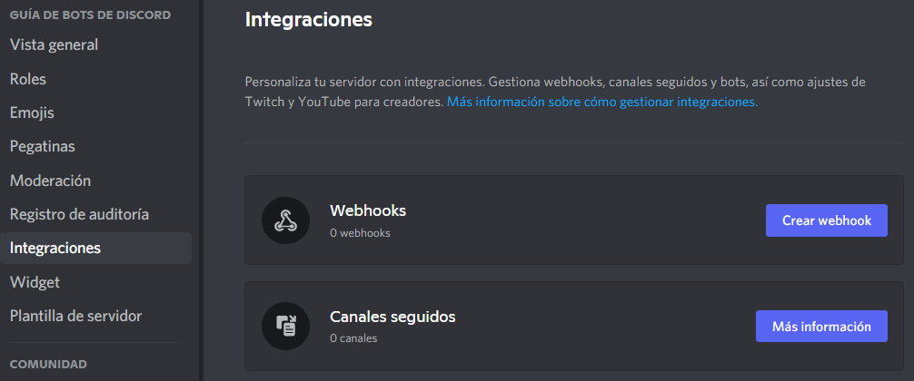

# Webhooks

Los webhooks pueden enviar mensajes a un canal de texto sin tener que iniciar sesión como bot. También pueden buscar, editar y eliminar sus propios mensajes. Hay una variedad de métodos en discord.js para interactuar con webhooks. En esta sección, aprenderás a crear, recuperar, editar y utilizar webhooks.

## ¿Qué es un webhook?

Los webhooks son una utilidad que se utilizan para enviar mensajes a canales de texto sin necesidad de un bot de Discord. Los webhooks son útiles para permitir que algo envíe mensajes sin requerir un bot de Discord. También puedes editar o eliminar directamente los mensajes que envió a través del webhook. Hay dos estructuras para hacer uso de esta funcionalidad: `Webhook` y `WebhookClient`. `WebhookClient` es una versión extendida de un `Webhook`, que te permite enviar mensajes a través de él sin necesidad de un cliente bot.

::: tip
Si quieres leer sobre el uso de webhooks a través de la API sin discord.js, puedes leer sobre ellos [aquí](https://discord.com/developers/docs/resources/webhook).
:::

Detectar mensajes de webhooks

Los bots reciben mensajes de webhooks en un canal de texto como de costumbre. Puedes detectar si un webhook envió el mensaje comprobando si el `Message.webhookId` no es `null`. En este ejemplo, revisamos si un webhook envió el mensaje.

<!-- eslint-skip -->
```js
if (message.webhookId) return;
```

Si quieres obbtener el objeto webhook que envió el mensaje, puedes usar <DocsLink path="class/Message?scrollTo=fetchWebhook">`Message#fetchWebhook`</DocsLink>.

## Obteniendo webhooks

::: tip
La búsqueda de webhook siempre hará uso de colecciones y promesas. Si no comprendes ninguno de los conceptos, revisalos y luego vuelve a esta sección. Puedes leer esto sobre colecciónes [Aquí](/additional-info/collections.md), y propesas [aquí](/additional-info/async-await.md) y [aquí](https://developer.mozilla.org/en-US/docs/Web/JavaScript/Guide/Using_promises).
:::

### Fetching all webhooks of a guild

If you would like to get all webhooks of a guild you can use <DocsLink path="class/Guild?scrollTo=fetchWebhooks">`Guild#fetchWebhooks()`</DocsLink>. This will return a Promise which will resolve into a Collection of `Webhook`s.

### Obteniendo webhooks de un canal

Los webhooks que pertenecen a un canal se pueden recuperar usando <DocsLink path="class/TextChannel?scrollTo=fetchWebhooks">`TextChannel#fetchWebhooks()`</DocsLink>. Esto devolverá una promesa que se resolverá en una colección de `Webhook`s. Se devolverá una colección incluso si el canal contiene un solo webhook. Si estás seguro de que el canal contiene un único webhook, puedes usar <DocsLink section="collection" path="class/Collection?scrollTo=first">`Collection#first()`</DocsLink> en la colección para obtener el webhook.

### Obteniendo un solo webhook

#### Usando el cliente

Puedes obtener un webhook específico usando su `id` con <DocsLink path="class/Client?scrollTo=fetchWebhook">`Client#fetchWebhook()`</DocsLink>. Puedes obtener la ID del webhook mirando su enlace, el número después de `https://discord.com/api/webhooks/` es el `id`, y la parte posterior es el `token`.

#### Usando el constructor WebhookClient

Si no estás utilizando un cliente de bot, puedes obtener un webhook creando una nueva instancia de `WebhookClient` y pasando el` id` y el `token` al constructor. Estas credenciales no requieren que tengas una aplicación de bot, pero también ofrece información limitada en lugar de obtenerla con un cliente autorizado.

```js
const webhookClient = new WebhookClient({ id: 'id', token: 'token' });
```

Tanbién puedes pasar solo una `url`:

```js
const webhookClient = new WebhookClient({ url: 'https://discord.com/api/webhooks/id/token' });
```

## Creando webhooks

### Creación de webhooks a través de la configuración del servidor

Puedes crear webhooks directamente a través del cliente de Discord. Ve a Configuración del servidor y verás una pestaña de "Integraciones".



If you already have created a webhook, the webhooks tab will look like this; you will need to click the `View Webhooks` button.


Once you are there, click on the `Create Webhook` / `New Webhook` button; this will create a webhook. From here, you can edit the channel, the name, and the avatar. Copy the link, the first part is the id, and the second is the token.


### Creating webhooks with discord.js

Webhooks can be created with the <DocsLink path="class/TextChannel?scrollTo=createWebhook">`TextChannel#createWebhook()`</DocsLink> method.

```js
channel.createWebhook('Some-username', {
	avatar: 'https://i.imgur.com/AfFp7pu.png',
})
	.then(webhook => console.log(`Created webhook ${webhook}`))
	.catch(console.error);
```

## Editing webhooks

You can edit Webhooks and WebhookClients to change their name, avatar, and channel using <DocsLink path="class/Webhook?scrollTo=edit">`Webhook#edit()`</DocsLink>.

```js
webhook.edit({
	name: 'Some-username',
	avatar: 'https://i.imgur.com/AfFp7pu.png',
	channel: '222197033908436994',
})
	.then(webhook => console.log(`Edited webhook ${webhook}`))
	.catch(console.error);
```

## Using webhooks

Webhooks can send messages to text channels, as well as fetch, edit, and delete their own. These methods are the same for both `Webhook` and `WebhookClient`.

### Sending messages

Webhooks, like bots, can send up to 10 embeds per message. They can also send attachments and normal content. The <DocsLink path="class/Webhook?scrollTo=send">`Webhook#send()`</DocsLink> method used to send to a webhook is very similar to the method used for sending to a text channel. Webhooks can also choose how the username and avatar will appear when they send the message.

Example using a WebhookClient:

```js
const { MessageEmbed, WebhookClient } = require('discord.js');
const { webhookId, webhookToken } = require('./config.json');

const webhookClient = new WebhookClient({ id: webhookId, token: webhookToken });

const embed = new MessageEmbed()
	.setTitle('Some Title')
	.setColor('#0099ff');

webhookClient.send({
	content: 'Webhook test',
	username: 'some-username',
	avatarURL: 'https://i.imgur.com/AfFp7pu.png',
	embeds: [embed],
});
```

Example using a Webhook:

```js
const { Client, Intents, MessageEmbed } = require('discord.js');
const { token } = require('./config.json');

const client = new Client({ intents: [Intents.FLAGS.GUILDS] });

const embed = new MessageEmbed()
	.setTitle('Some Title')
	.setColor('#0099ff');

client.once('ready', async () => {
	const channel = client.channels.cache.get('123456789012345678');
	try {
		const webhooks = await channel.fetchWebhooks();
		const webhook = webhooks.first();

		await webhook.send({
			content: 'Webhook test',
			username: 'some-username',
			avatarURL: 'https://i.imgur.com/AfFp7pu.png',
			embeds: [embed],
		});
	} catch (error) {
		console.error('Error trying to send a message: ', error);
	}
});

client.login(token);
```

### Fetching messages

You can use <DocsLink path="class/Webhook?scrollTo=fetchMessage">`Webhook#fetchMessage()`</DocsLink> to fetch messages previously sent by the Webhook.

<!-- eslint-skip -->

```js
const message = await webhookClient.fetchMessage('123456789012345678');
```

### Editing messages

You can use <DocsLink path="class/Webhook?scrollTo=editMessage">`Webhook#editMessage()`</DocsLink> to edit messages previously sent by the Webhook.

<!-- eslint-skip -->

```js
const message = await webhook.editMessage('123456789012345678', {
	content: 'Edited!',
	username: 'some-username',
	avatarURL: 'https://i.imgur.com/AfFp7pu.png',
	embeds: [embed],
});
```

### Deleting messages

You can use <DocsLink path="class/Webhook?scrollTo=deleteMessage">`Webhook#deleteMessage()`</DocsLink> to delete messages previously sent by the Webhook.

<!-- eslint-skip -->

```js
await webhookClient.deleteMessage('123456789012345678');
```

## Resulting code

<ResultingCode/>
