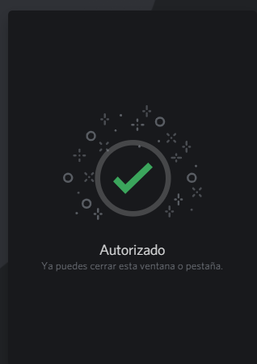
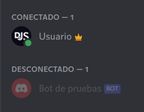

# Añadiendo tu bot a servidores

Si has seguido las guías en las anteriores páginas, ya deberías tener una aplicación de bot. Como sea, el bot aún no está en ningún servidor aún. Así que, ¿cómo es que esto funciona?

Antes de ver tu bot en tu propio (u otro) servidor, necesitas añadirlo creando y usando una invitación única usando la ID de la aplicación.

## Enlaces de invitación

La versión básica del enlace luce algo así:

```
https://discord.com/api/oauth2/authorize?client_id=123456789012345678&permissions=0&scope=bot%20applications.commands
```

La estructura del URL es bastante simple:

* La primera parte es solo la estructura estándar de Discord para actualizar una aplicación OAuth2 (como tu aplicación del bot) para entrar a un servidor de Discord.
* La segunda parte la cual dice `client_id=...` es para especificar _cual_ aplicación quieres autorizar. Necesitaras remplazar esta parte con la ID del cliente para crear un enlace de invitación valido.
* La tercer parte la cual dice `permissions=...` indica que permisos tendrá tu bot al ser añadido.
* Como último, la cuarta parte, la cual dice `scope=bot%20application.commands`, especifica que quieres añadir la aplicación como un bot de Discord, con la habilidad de crear Slash Commands (comandos de barra).

::: warning ADVERTENCIA
Si obtienes un error diciendo "Bot requires a code grant", entonces ve a las configuraciones de tu aplicación y deshabilita la opción "Require OAuth2 Code Grant". Usted usualmente no habilitará esta opción si no sabe para que lo necesita.
:::

## Creando y usando el enlace de invitación

Para crear un link de invitación, dirígete a [My Apps](https://discord.com/developers/applications/me), abajo de la sección "Applications" y clic en la aplicación de tu bot.

Al final de la página, encontrarás el generador de URL OAuth2 de Discord. Selecciona las opciones `bot` y `applications.commands`. Cuando selecciones la opción de `bot`, una lista de permisos aparecerán, permitiéndote configurar los permisos que tu bot necesite.

Presiona el botón correspondiente para copiar y abrir el enlace en el navegador. Deberías ver algo como esto (con el nombre y avatar del bot):


Elige el servidor al cual quieras añadirlo y haz clic en "Authorize". Hay que recalcar que necesitas el permiso "Gestionar servidor" en el servidor al cual quieras añadir el bot. Esto debería presentarte un buen mensaje de confirmación:




¡Felicidades! Has añadido tu bot a tu servidor de Discord. Este debería mostrarse en la lista de miembros:


