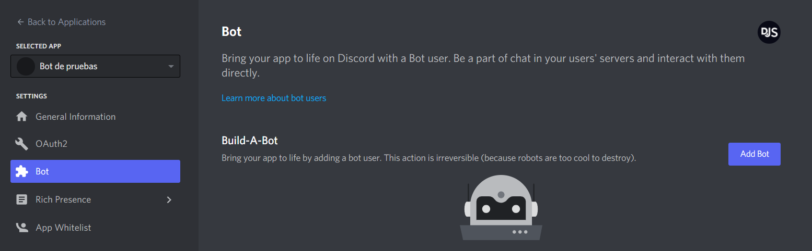
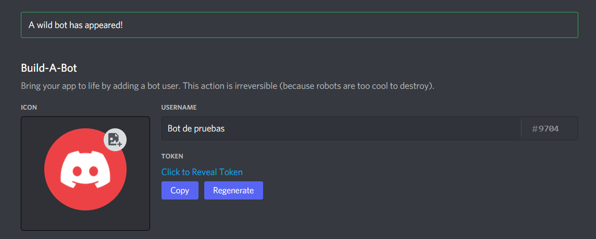

# Configurar una aplicación bot

## Creando tu bot

Ahora que ha instalado Node, discord.js y, con suerte, un linter, ¡está casi listo para comenzar a codificar! El siguiente paso que debe tomar es configurar una aplicación de bot de Discord real a través del sitio web de Discord.

Es fácil crear uno. Los pasos que debe seguir son los siguientes:

1. Abre [el portal para desarrolladores de Discord](https://discord.com/developers/applications) e inicie sesión en su cuenta.
2. Haga clic en el botón "New Application".
3. Ingrese un nombre y, opcionalmente, seleccione un equipo (si desea que el bot pertenezca a uno). Luego, confirme la ventana emergente haciendo clic en el botón "Create".

Debería ver una página como esta:


Opcionalmente, puede ingresar un nombre, una descripción y un avatar para su aplicación aquí. Una vez que haya guardado sus cambios, puede continuar seleccionando la pestaña "Bot" en el panel izquierdo.



Haga clic en el botón "Add Bot" a la derecha y confirme la ventana emergente haciendo clic en "Yes, do it!". ¡Felicitaciones, ahora eres el orgulloso propietario de un nuevo y brillante bot de Discord! Sin embargo, no ha terminado del todo.

## Tu token

::: danger PELIGRO
Esta sección es fundamental, así que preste mucha atención. Explica cuál es su `token` de bot, así como sus aspectos de seguridad.
:::

Después de crear un usuario de bot, verá una sección como esta:



En este panel, puede darle a su bot un avatar elegante, establecer su nombre de usuario y hacerlo público o privado. También puede acceder a su `token` en este panel, ya sea revelándolo o presionando el botón "Copy". Cuando le pedimos que pegue su `token` en algún lugar, este es el valor que debe ingresar. No se preocupe si lo pierde en algún momento; siempre puede volver a esta página y copiarla de nuevo.

### ¿De todos modos, qué es un token?

Un token es esencialmente la contraseña de su bot; es lo que usa su bot para iniciar sesión en Discord. Dicho esto, **es vital que nunca compartas este token con nadie, intencional o accidentalmente**. Si alguien logra hacerse con su token, puede usar su bot como si fuera suyo; esto significa que puede realizar actos maliciosos con él.

Los tokens se ven así: `NzkyNzE1NDU0MTk2MDg4ODQy.X-hvzA.Ovy4MCQywSkoMRRclStW4xAYK7I` (¡no se preocupe, restablecemos este token inmediatamente antes de publicarlo aquí!). Si es más corto y se parece más a esto: `kxbsDRU5UfAaiO7ar9GFMHSlmTwYaIYn`, en su lugar, copió el secreto de su cliente. ¡Asegúrate de copiar el token si quieres que tu bot funcione!

### Escenario de fuga de tokens

Imaginemos que tiene un bot en más de 1,000 servidores, y le tomó muchos, muchos meses de codificación y paciencia para obtener esa cantidad. Su token se filtró en alguna parte y ahora alguien más lo tiene. Esa persona puede:

* Envíar mensajes no deseado a todos los servidores en los que se encuentra su bot;
* Intentar enviar spam por mensajes directos a tantos usuarios como sea posible;
* Intentar eliminar tantos canales como sea posible;
* Intentar expulsar o bannear a tantos miembros del servidor como sea posible;
* Hagcer que su bot abandone todos los servidores a los que se ha unido.
* Acceda y dañe la infraestructura subyacente (su servidor)

Todo eso y mucho, mucho más. Suena bastante terrible, ¿verdad? ¡Así que asegúrese de mantener su token lo más seguro posible!

::: danger PELIGRO
Si alguna vez compromete su token de bot actual (consignarlo en un repositorio público, publicarlo en soporte, etc.) o si ve a su bot en peligro, regrese a esta página y presione "Regenerate" para generar un nuevo token. Al hacerlo, todos los tokens antiguos quedarán invalidados. Tenga en cuenta que deberá actualizar su token donde lo usó antes.
:::

### Manteniendo tu token a salvo

Ahora que explicamos por qué su token es esencial y por qué debe evitar dárselo a otras personas, hablemos rápidamente sobre cómo puede evitar que se filtre accidentalmente.

#### Variables de entorno

Las variables de entorno son valores especiales que su entorno (por ejemplo, su consola, contenedor docker o archivo de variable de entorno) puede pasar al alcance de su código para que pueda usarlos dentro.

Una forma de pasar variables de entorno es a través de la interfaz de línea de comandos que utiliza para iniciar el proceso de node. Al iniciar su aplicación, en lugar de `node index.js` para comenzar su proceso, puede usar` TOKEN = NzkyNzE1NDU0MTk2MDg4ODQy.X-hvzA.Ovy4MCQywSkoMRRclStW4xAYK7I node index.js`. Puede repetir este patrón para exponer también otros valores: `TOKEN = NzkyNzE1NDU0MTk2MDg4ODQy.X-hvzA.Ovy4MCQywSkoMRRclStW4xAYK7I A = 123 B = 456 node index.js`

Puede acceder a los valores establecidos en su código a través del `process.env` global, accesible desde cualquier archivo. Tenga en cuenta que los valores pasados de esta manera siempre serán cadenas y que es posible que deba analizarlos en un número antes de usarlos para hacer cálculos.

```js
// index.js
// ... configuración del cliente (sigue leyendo)
console.log(process.env.A);
console.log(process.env.B);
client.login(process.env.TOKEN);
```

Otro enfoque común es almacenar estos valores en un archivo llamado `.env` (algunas soluciones de alojamiento ignoran automáticamente los archivos `.env` y los cargan en su proceso. En breve cubriremos cómo mantenerlos a salvo del seguimiento codicioso de git en una sección posterior debajo). Este enfoque es menos propenso a errores tipográficos y le evita tener que copiar siempre tokens en su línea de comandos. Cada línea de este archivo contendrá un par clave-valor separado por el carácter `=`.

```
TOKEN=NzkyNzE1NDU0MTk2MDg4ODQy.X-hvzA.Ovy4MCQywSkoMRRclStW4xAYK7I
A=123
B=456
```

Para cargar variables desde un archivo en el proceso, puede escribir el código para hacerlo usted mismo o simplemente usar el paquete `dotenv` de npm ejecutando la instrucción de línea de comando `npm install dotenv` en la raíz de su proyecto. A continuación, puede solicitar y utilizar el paquete en la parte superior de su archivo principal para cargar su archivo `.env` y adjuntar las variables al global `process.env` como se muestra a continuación:

```js
// index.js
const dotenv = require('dotenv');

dotenv.config();
// ... configuración del cliente (sigue leyendo)
console.log(process.env.A);
console.log(process.env.B);
client.login(process.env.TOKEN);
```

#### Git y .gitignore

Git es una herramienta fantástica para realizar un seguimiento de los cambios de su código y le permite cargar el progreso a servicios como [GitHub](https://github.com/), [GitLab](https://about.gitlab.com/) o [Bitbucket](https://bitbucket.org/product). Si bien esto es muy útil para compartir código con otros desarrolladores, ¡también conlleva el riesgo de cargar sus archivos de configuración con valores confidenciales!

Puede especificar archivos que git debe ignorar y no agregar a sus sistemas de control de versiones en un archivo llamado `.gitignore`. Para hacerlo, cree un archivo llamado `.gitignore` en el directorio raíz de su proyecto y agregue los nombres de los archivos y carpetas que desea ignorar:

```
node_modules/
.env
config.json
```

::: tip
Además de mantener las credenciales seguras, puede (y debe) agregar `node_modules` aquí. Este directorio se puede restaurar en función de sus entradas en `package.json` y` package-lock.json` ejecutando `npm install` después de la descarga y no es necesario incluirlo en git.

Puede especificar patrones bastantes complicados en archivos `.gitignore`, consulte la [documentación de git sobre `.gitignore`](https://git-scm.com/docs/gitignore) para obtener más información!
:::

#### Editores en linea

Si bien generalmente no recomendamos el uso de editores en línea como soluciones de alojamiento, sino invertir en un servidor privado virtual adecuado, estos servicios también ofrecen formas de mantener sus credenciales seguras. Consulte la documentación del servicio correspondiente y los artículos de ayuda para obtener más información sobre cómo mantener segura la información confidencial:

- Glitch.com: [almacenar secretos en .env](https://glitch.happyfox.com/kb/article/18)
- Heroku.com: [variables de configuración](https://devcenter.heroku.com/articles/config-vars)
- Repl.it: [secretos y variables de entorno](https://docs.replit.com/repls/secrets-environment-variables)
