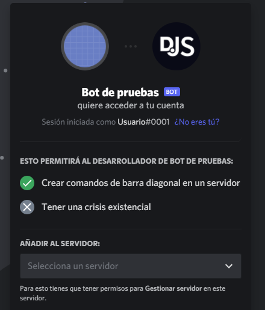

# Añadiendo tu bot a servidores

Si has seguido las guías en las anteriores páginas, ya deberías tener una aplicación de bot. Como sea, el bot aún no está en ningún servidor aún. Así que, ¿cómo es que esto funciona?

Antes de ver tu bot en tu propio (u otro) servidor, necesitas añadirlo creando y usando una invitación única usando la ID de la aplicación.

## Enlaces de invitación

La versión básica del enlace luce algo así:

```
https://discord.com/oauth2/authorize?client_id=123456789012345678&scope=bot+applications.commands
```

La estructura del url es bastante simple:

* La primera parte es solo la estructura estándar de Discord para actualizar una aplicación OAuth2 (como tu aplicación del bot) para entrar a un servidor de Discord.
* La segunda parte la cual dice `client_id=...` es para especificar _cual_ aplicación quieres autorizar. Necesitaras remplazar esta parte con la ID del cliente para crear un enlace de invitación valido.
* Como último, la tercera parte, la cual dice `scope=bot+application.commads`, especifica que quieres añadir la aplicación como un bot de Discord, con la habilidad de crear Slash Commands (comandos de barra).


::: tip
El parámetro `permissions` también existe para restringir o garantizar el (o los) permiso que tu bot va a tener en el servidor en el cual añadiendo. Para facilidad de uso, es recomendado usar [esta](https://discordapi.com/permissions.html) página.
:::

::: warning ADVERTENCIA
Si obtienes un error diciendo "Bot requires a code grant", entonces ve a las configuraciones de tu aplicación y deshabilita la opción "Require OAuth2 Code Grant". Usted usualmente no habilitará esta opción si no sabe para que lo necesita.
:::

## Creando y usando el enlace de invitación

Como mencionamos arriba, necesitas remplazar el parámetro `client_id` con la ID del cliente para generar el enlace de invitación. Para encontrar la ID de la aplicación, dirígete a la página [My Apps](https://discord.com/developers/applications/me), abajo de la sección "Applications" una vez más y clic en la aplicación de tu bot.

Inserta la ID de la aplicación en el ejemplo, y entonces abre el enlace en el navegador. Deberías ver algo como esto (con el nombre y avatar del bot):



Elige el servidor al cual quieras añadirlo y haz clic en "Authorize". Hay que recalcar que necesitas el permiso "Gestionar servidor" en el servidor al cual quieras añadir el bot. Esto debería presentarte un buen mensaje de confirmación:


¡Felicidades! Has añadido tu bot a tu servidor de Discord. Este debería mostrarse en la lista de miembros:


