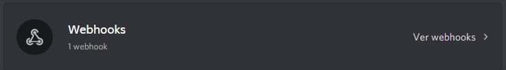
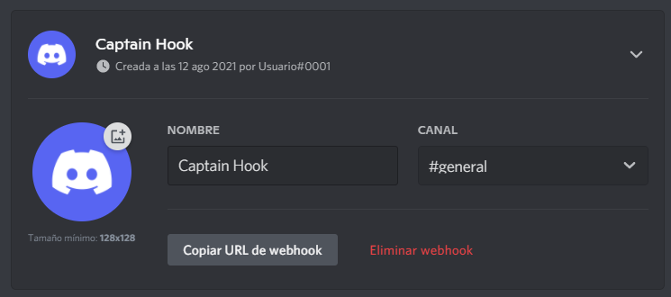

# Webhooks

Las webhooks pueden enviar mensajes a un canal de texto sin tener que iniciar sesión como bot. También pueden buscar, editar y eliminar sus propios mensajes. Hay una variedad de métodos en discord.js para interactuar con webhooks. En esta sección, aprenderás a crear, buscar, editar y utilizar webhooks.

## ¿Qué es un webhook?

Los webhooks son una utilidad que se utilizan para enviar mensajes a canales de texto sin necesidad de un bot de Discord. Los webhooks son útiles para permitir que algo envíe mensajes sin requerir un bot de Discord. También puedes editar o eliminar directamente los mensajes que envió a través del webhook. Hay dos estructuras para hacer uso de esta funcionalidad: `Webhook` y `WebhookClient`. `WebhookClient` es una versión extendida de un `Webhook`, que te permite enviar mensajes a través de él sin necesidad de un cliente bot.

::: tip
Si quieres leer sobre el uso de webhooks a través de la API sin discord.js, puedes leer sobre ellos [aquí](https://discord.com/developers/docs/resources/webhook).
:::

Detectar mensajes de webhooks

Los bots reciben mensajes de webhooks en un canal de texto como de costumbre. Puedes detectar si un webhook envió el mensaje comprobando si el `Message.webhookId` no es `null`. En este ejemplo, revisamos si un webhook envió el mensaje.

<!-- eslint-skip -->
```js
if (message.webhookId) return;
```

Si quieres obtener el objeto `Webhook` que envió el mensaje, puedes usar el método <DocsLink path="class/Message?scrollTo=fetchWebhook" type="method" />.

## Obteniendo webhooks

::: tip
La búsqueda de webhooks siempre hará uso de colecciones y promesas. Si no comprendes ninguno de los conceptos, revísalos y luego vuelve a esta sección. Puedes leer sobre colecciones [aquí](/informacion-adicional/colecciones.md), y  sobre promesas [aquí](/informacion-adicional/async-await.md) y [aquí](https://developer.mozilla.org/es/docs/Web/JavaScript/Guide/Using_promises).
:::

### Obteniendo todos los webhooks de un Guild

Puedes obtener todos los webhoooks de un Guild usando <DocsLink path="class/Guild?scrollTo=fetchWebhooks" type="method" />. Esto devolverá una promesa que se resolverá en una colección de `Webhook`s.
### Obteniendo webhooks de un canal

Los webhooks que pertenecen a un canal se pueden recuperar usando <DocsLink path="class/TextChannel?scrollTo=fetchWebhooks" type="method" />. Esto devolverá una promesa que se resolverá en una colección de `Webhook`s. Se devolverá una colección incluso si el canal contiene un solo webhook. Si estás seguro de que el canal contiene un único webhook, puedes usar <DocsLink section="collection" path="class/Collection?scrollTo=first" type="method" /> en la colección para obtener el webhook.

### Obteniendo un solo webhook

#### Usando el cliente

Puedes obtener un webhook específico usando su `id` con <DocsLink path="class/Client?scrollTo=fetchWebhook" type="method" />. Puedes obtener la ID del webhook mirando su enlace, el número después de `https://discord.com/api/webhooks/` es el `id`, y la parte posterior es el `token`.

#### Usando el constructor WebhookClient

Si no estás utilizando un cliente de bot, puedes obtener un webhook creando una nueva instancia de `WebhookClient` y pasando el` id` y el `token` al constructor. Estas credenciales no requieren que tengas una aplicación de bot, pero también ofrece información limitada en lugar de obtenerla con un cliente autorizado.

```js
const webhookClient = new WebhookClient({ id: 'id', token: 'token' });
```

Tanbién puedes pasar solo una `url`:

```js
const webhookClient = new WebhookClient({ url: 'https://discord.com/api/webhooks/id/token' });
```

## Creando webhooks

### Creación de webhooks a través de la configuración del servidor

Puedes crear webhooks directamente a través del cliente de Discord. Ve a Configuración del servidor y verás una pestaña de "Integraciones".


Si ya has creado un webhook, la pestaña de webhooks se verá así; deberás hacer clic en el botón `Ver webhooks`.



Una vez que estés ahí, haz clic en el botón `Crear webhook` / ` Nuevo webhook`; esto creará un webhook. Desde aquí, puedes editar el canal, el nombre y el avatar. Copia el enlace, la primera parte es la identificación y la segunda es el token.



### Creando webhooks con discord.js

Los webhooks se pueden crear con el método <DocsLink path="class/TextChannel?scrollTo=createWebhook" type="method" />.

```js
channel.createWebhook('Some-username', {
	avatar: 'https://i.imgur.com/AfFp7pu.png',
})
	.then(webhook => console.log(`Webhook creado: ${webhook}`))
	.catch(console.error);
```

## Editar webhooks

Puedes editar `Webhook`s y `WebhookClient`s para cambiar su nombre, avatar y canal usando <DocsLink path="class/Webhook?scrollTo=edit" type="method" />.

```js
webhook.edit({
	name: 'Some-username',
	avatar: 'https://i.imgur.com/AfFp7pu.png',
	channel: '222197033908436994',
})
	.then(webhook => console.log(`Webhook editado: ${webhook}`))
	.catch(console.error);
```

## Usar webhooks
Los webhooks pueden enviar mensajes a canales de texto, así como recuperar, editar y eliminar los tuyos. Estos métodos son los mismos para ambos `Webhook` y `WebhookClient`.

### Enviando mensajes

Los webhooks, como los bots, pueden enviar hasta 10 incrustaciones por mensaje. También pueden enviar archivos adjuntos y contenido normal. El método <DocsLink path="class/Webhook?scrollTo=send" type="method" /> utilizado para enviar a una webhook es muy similar al método utilizado para enviar a un canal de texto. Los webhooks también pueden elegir cómo aparecerá el nombre de usuario y el avatar cuando envíen el mensaje.

Ejemplo usando un WebhookClient:

```js
const { MessageEmbed, WebhookClient } = require('discord.js');
const { webhookId, webhookToken } = require('./config.json');

const webhookClient = new WebhookClient({ id: webhookId, token: webhookToken });

const embed = new MessageEmbed()
	.setTitle('Titulo')
	.setColor('#0099ff');

webhookClient.send({
	content: 'Webhook test',
	username: 'some-username',
	avatarURL: 'https://i.imgur.com/AfFp7pu.png',
	embeds: [embed],
});
```

Ejemplo usando un Webhook:

```js
const { Client, Intents, MessageEmbed } = require('discord.js');
const { token } = require('./config.json');

const client = new Client({ intents: [Intents.FLAGS.GUILDS] });

const embed = new MessageEmbed()
	.setTitle('Titulo')
	.setColor('#0099ff');

client.once('ready', async () => {
	const channel = client.channels.cache.get('123456789012345678');
	try {
		const webhooks = await channel.fetchWebhooks();
		const webhook = webhooks.first();

		await webhook.send({
			content: 'Webhook test',
			username: 'some-username',
			avatarURL: 'https://i.imgur.com/AfFp7pu.png',
			embeds: [embed],
		});
	} catch (error) {
		console.error('Error al intentar enviar un mensaje: ', error);
	}
});

client.login(token);
```

### Obteniendo mensajes

Puedes usar <DocsLink path="class/Webhook?scrollTo=fetchMessage" type="method" /> para obtener mensajes enviados previamente por el Webhook.

<!-- eslint-skip -->

```js
const message = await webhookClient.fetchMessage('123456789012345678');
```

### Editando mensajes

Puedes usar <DocsLink path="class/Webhook?scrollTo=editMessage" type="method" /> para editar mensajes enviados previamente por el Webhook.

<!-- eslint-skip -->

```js
const message = await webhook.editMessage('123456789012345678', {
	content: '¡Editado!',
	username: 'algún-nombre-de-usuario',
	avatarURL: 'https://i.imgur.com/AfFp7pu.png',
	embeds: [embed],
});
```

### Eliminando mensajes

Puedes usar <DocsLink path="class/Webhook?scrollTo=deleteMessage" type="method" /> para eliminar mensajes enviados previamente por el Webhook.

<!-- eslint-skip -->

```js
await webhookClient.deleteMessage('123456789012345678');
```

## Resultado del código

<ResultingCode/>

